


 

 

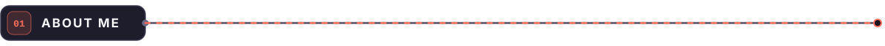

I build backend applications with **Java + Spring Boot** and explore how modern AI can be integrated into practical software systems.

<table width="100%">
<tr>
<td align="center" width="25%">
<b>☕ BACKEND</b>  
Java · OOP · DSA 
Spring Boot 
REST APIs 
Spring Security
</td>
<td align="center" width="25%">
<b>🧠 AI</b>  
Spring AI 
LLMs 
RAG 
Embeddings
</td>
<td align="center" width="25%">
<b>🗄️ DATA</b>  
MySQL 
PostgreSQL 
PGVector 
Vector Search
</td>
<td align="center" width="25%">
<b>⚙️ DEVOPS</b>  
Docker 
Kubernetes 
Linux 
Git · CI/CD
</td>
</tr>
</table>

 

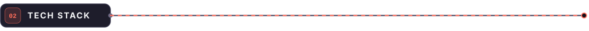

<code>BACKEND &amp; PROGRAMMING</code> 

<code>WEB</code> 

<code>DATABASES</code> 

<code>DEVOPS &amp; TOOLS</code> 

 

<code>IntelliJ IDEA</code> · <code>MySQL Workbench</code> · <code>SonarQube</code> · <code>Maven</code> · <code>Postman</code>

 

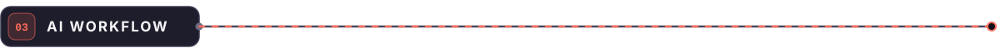


<b>Currently exploring</b> 
<code>Spring AI</code> · <code>ChatClient</code> · <code>RAG</code> · <code>Embeddings</code> · <code>Vector Search</code> · <code>PGVector</code> · <code>Ollama</code> · <code>Gemini</code> · <code>Prompt Engineering</code> · <code>Tool Calling</code> · <code>MCP</code>

 

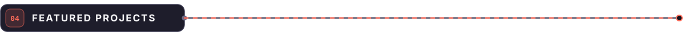

<table width="100%">
<tr>
<td width="33%"><a href="https://github.com/mokal2002/Contact-Manager-Using-Spring">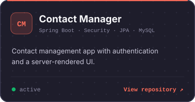</a></td>
<td width="33%"><a href="https://github.com/mokal2002">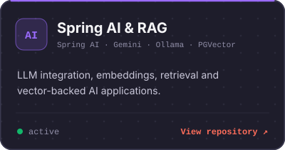</a></td>
<td width="33%"><a href="https://github.com/mokal2002/Java-Swing-Chat-Application">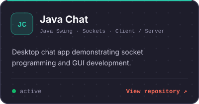</a></td>
</tr>
<tr>
<td width="33%"><a href="https://github.com/mokal2002/Core-Java-Projects">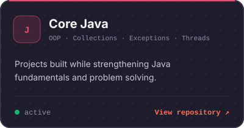</a></td>
<td width="33%"><a href="https://github.com/mokal2002/College-Project-eBookLibrary">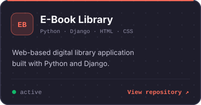</a></td>
<td width="33%"><a href="https://github.com/mokal2002/LearnDocker">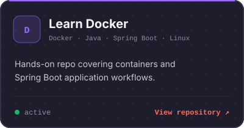</a></td>
</tr>
</table>

 

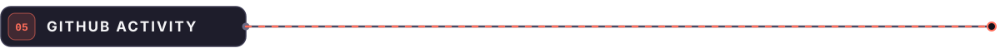

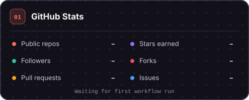
&nbsp;
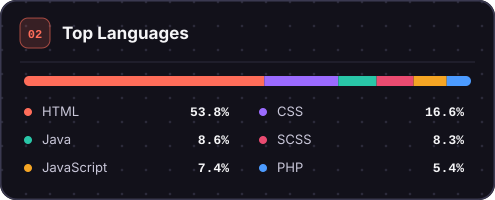

 

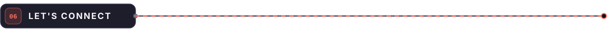

  

&nbsp;

&nbsp;

  


